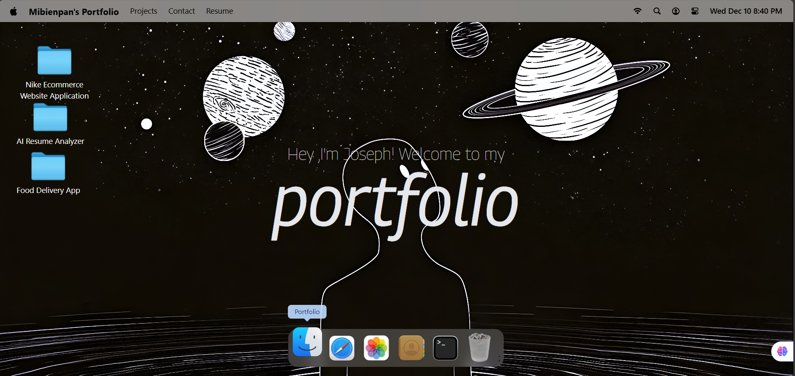

# macOS Portfolio

A personal portfolio website presented as a macOS‑inspired desktop. It features a dynamic Dock with magnification, draggable app windows, smooth animations, and multiple built‑in "apps" (Terminal, Safari/Blog, Finder, Resume, Photos, Contact, etc.) to showcase projects, experience, and links — all inside a playful, familiar UI.

## Features
- macOS‑style desktop experience with Navbar, Welcome screen, Dock, and floating windows
- Dock magnification and hover effects powered by GSAP
- Draggable, focusable windows with z‑index management (bring to front on focus)
- Built‑in windows/apps:
  - Terminal: lists the tech stack and commands-like presentation
  - Safari: developer blog links feed
  - Resume: embedded PDF viewer
  - Finder: quick navigation to locations/sections
  - Text & Image: simple content viewers
  - Photos: gallery of selected images
  - Contact: social links and ways to reach me
- State management for window open/close/focus
- Responsive layout with Tailwind CSS

## Tech Stack
- React 19 + Vite 7
- Tailwind CSS 4
- GSAP 3 (`gsap` + `Draggable` plugin) and `@gsap/react`
- Zustand (with `immer` middleware) for state
- `lucide-react` icons
- `react-pdf` for viewing the resume PDF
- Utilities: `dayjs`, `clsx`, `react-tooltip`

## Project Structure
```
macos-portfolio/
├─ index.html
├─ package.json
├─ vite.config.js                 # Vite config + path aliases (#components, #windows, #constants, #store, #hoc)
├─ public/
│  └─ images/                     # App icons and image assets (used by Dock and windows)
└─ src/
   ├─ App.jsx                     # Composes Navbar, Welcome, Dock and all windows
   ├─ main.jsx                    # App entry
   ├─ index.css                   # Global styles (Tailwind layers + custom)
   ├─ components/
   │  ├─ Navbar.jsx
   │  ├─ Welcome.jsx
   │  ├─ Dock.jsx                 # Dock with GSAP magnification
   │  ├─ WindowControls.jsx       # macOS window traffic-light controls
   │  ├─ Home.jsx
   │  └─ index.js                 # Barrel exports
   ├─ windows/                    # Individual app windows
   │  ├─ Terminal.jsx
   │  ├─ Safari.jsx
   │  ├─ Resume.jsx
   │  ├─ Finder.jsx
   │  ├─ Text.jsx
   │  ├─ Image.jsx
   │  ├─ Photos.jsx
   │  └─ index.js                 # Barrel exports
   ├─ store/
   │  └─ window.js                # Zustand store for window state & z-index
   ├─ constants/                  # Dock apps, links, initial z-index, etc.
   └─ hoc/
      └─ WindowWrapper.jsx        # HOC to wrap components into movable windows
```

### Path Aliases
Configured in `vite.config.js` for clean imports:
- `#components` → `src/components`
- `#windows` → `src/windows`
- `#constants` → `src/constants`
- `#store` → `src/store`
- `#hoc` → `src/hoc`

## Quick Start
Prerequisites:
- Node.js 18+ (recommended LTS)
- npm 9+ (or pnpm/yarn, adjust commands accordingly)

Install dependencies:
```
npm install
```

Start the dev server:
```
npm run dev
```
Vite will print a local URL (typically `http://localhost:5173`). Open it in your browser.


## Acknowledgements
- Inspired by macOS UI design and interactions
- Icons via `lucide-react`
- Animations via GSAP
- Thanks to JS-Mastery 

## License
This is a personal portfolio project. If you’d like to reuse parts of it, please give attribution. For commercial use, contact me.
